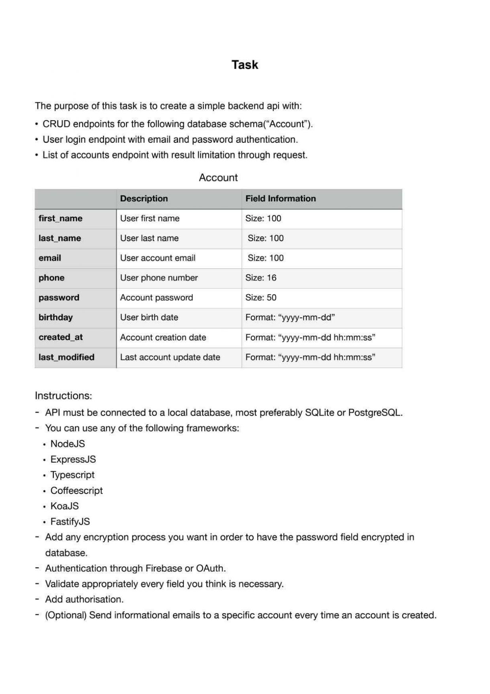

# @shahanahmed86/miletap-nodejs

## Prerequisites

- ### Resources
  - [Docker Desktop](https://docs.docker.com/desktop/ 'https://docs.docker.com/desktop/')
  - [NODE](https://nodejs.org/en/ 'https://nodejs.org/en/') or [NVM](https://gist.github.com/shahanahmed86/77616c67e0397a7ed2db89a4a71801d0#node-version-managers-using-nvm 'https://gist.github.com/shahanahmed86/77616c67e0397a7ed2db89a4a71801d0#node-version-managers-using-nvm')
  - [Make](https://linuxhint.com/install-make-ubuntu/ 'https://linuxhint.com/install-make-ubuntu/')
  - ### Knowledge
  - JavaScript
  - Restful
  - Docker architecture
  - Container orchestration with docker compose **_(at-least)_**
  - node:18 and its npm installer

## Implemented Feature

- User/Admin authentication APIs
- Users query for admin APIs
- Email will be send to the admin when a user signs up
- Pre-commit hook to check linting/testing and formatting
- Used JWT for authentication instead of firebase or oauth
- Chai & Mocha used to cover api testing

## Installation steps

```sh
cp .env.example .env # Please read the comments carefully

npm run up # to create containers for postgres and adminer
npm run down # to remove containers
npm run down:hard # to remove containers and clean their data also

# database migrations
npm run migrate:up # to run migrations (create tables and run seeds)
npm run migrate:down # it will only undo the last run migration

# finally
npm run start:dev # to run dev environment
```

